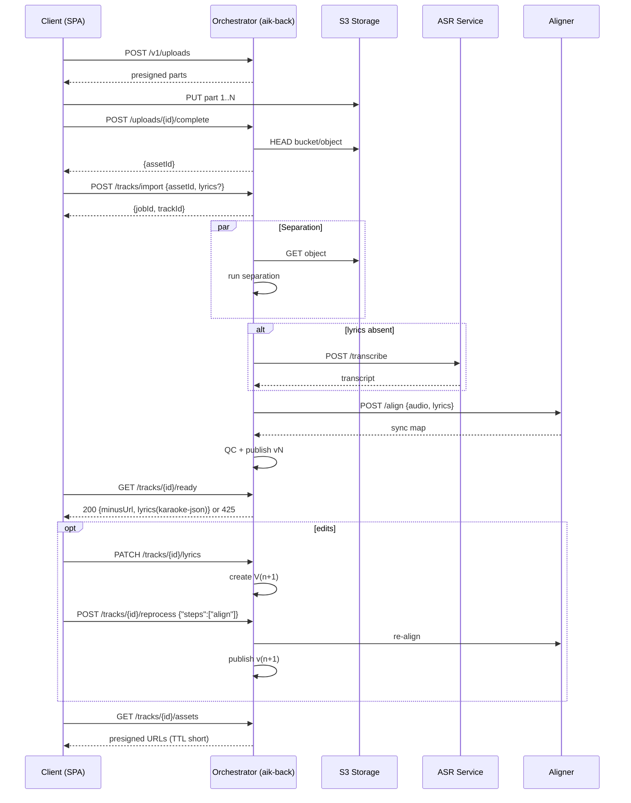
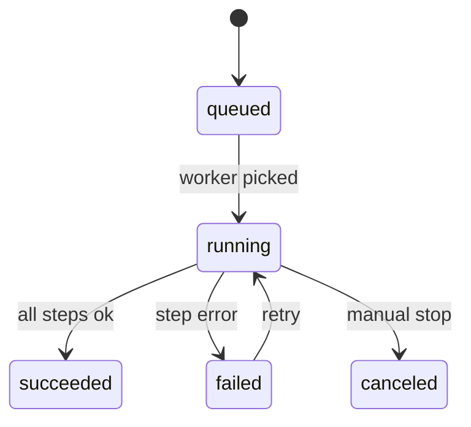

# Интеграция с пайплайном AI Karaoke

Этот документ описывает, как фронтенд SPA взаимодействует с бэкендом AI Karaoke и связанными сервисами при импорте треков, синхронизации лирики и публикации версий.

## 1. Сквозной поток импорта

```mermaid
flowchart TD
    A[SPA/Client] -->|POST /v1/uploads| B[Init multipart]
    B --> C[S3 presigned parts]
    A -->|PUT parts to S3| D[Object parts]
    A -->|POST /v1/uploads/{id}/complete| E[assetId]
    A -->|POST /v1/tracks/import {assetId, lyrics?}| F[jobId, trackId]
    subgraph Pipeline
      F --> G[Separation]
      G --> H{Lyrics provided?}
      H -- yes --> I[Align-fast]
      H -- no --> J[ASR]
      J --> I
      I --> K[QC]
      K --> L[Publish vN]
    end
    L --> M{GET /v1/tracks/{id}/ready}
    M -- 425 Not Ready --> N[/Retry with backoff/]
    M -- 200 OK --> O[minusUrl + karaoke-json]
    O --> P{Need edits?}
    P -- yes --> Q[PATCH /lyrics -> V(n+1)]
    Q --> R[POST /tracks/{id}/reprocess align]
    R --> L
    P -- no --> S[GET /assets (minus/vocals/mix)]
```

### Ключевые шаги
- Фронтенд инициирует многочастичную загрузку через `/v1/uploads`, получает пресайны и заливает объект напрямую в S3.
- После подтверждения загрузки оркестратор возвращает `assetId`, который используется для импорта трека.
- Пайплайн разделяет трек на минус/вокал, выполняет распознавание речи (если нет текста) и выравнивает лирику.
- Клиент опрашивает `/v1/tracks/{id}/ready`, пока не получит готовую версию с ссылкой на минус и караоке-JSON.
- Для правок текста создаётся новая версия и повторяется шаг выравнивания.

## 2. Взаимодействия сервисов



### Примечания по последовательности
- `par Separation` обозначает, что скачивание из S3 и запуск алгоритма разделения выполняются параллельно.
- Ответ 425 от `/ready` сигнализирует, что версия ещё не готова; фронтенд должен повторять запрос с экспоненциальной задержкой.
- Пресайны для `/assets` короткоживущие, их необходимо использовать сразу.

## 3. Стейт-машина задач импорта



### Поведение состояний
- Задачи создаются в `queued` и переходят в `running`, когда воркер подбирает работу.
- При ошибке шага задача переходит в `failed`; при ручном рестарте возвращается в `running`.
- Успешное завершение фиксируется состоянием `succeeded`; при отмене оператором — `canceled`.

## 4. Правила интеграции и безопасности

- Во всех запросах фронтенд передаёт заголовок корреляции `X-Client-Id`.
- Пресайны привязаны к IP-адресу и имеют короткий TTL, поэтому загрузку нужно выполнять немедленно после получения ссылок.
- Таймауты health-проверок зависимостей не превышают 1.5 секунды; у каждого шага пайплайна — собственные SLA, которые следует учитывать при отображении статусов.
- Ошибки API соответствуют RFC 7807 и содержат `traceId` для корреляции с логами.
- При импорте можно указать `callbackUrl`; оркестратор отправляет HMAC-подписанные вебхуки (`track.ready`, `job.failed`, `lyrics.updated`).

## 5. Рекомендации для SPA

- Логику загрузки файлов и опроса статуса выносите в сервисы/хуки, чтобы переиспользовать между экранами.
- Для обработки ошибок отображайте `traceId`, чтобы поддержка могла быстро найти проблему.
- При получении вебхуков обновляйте локальный стор с новыми версиями трека и лирики.
- Используйте backoff-стратегию при опросе `/ready`, чтобы не перегружать оркестратор.
